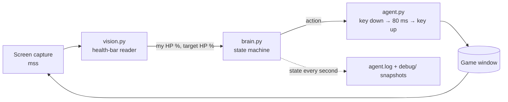

# Vision Desktop Agent — a computer-vision game bot

An **MMO farming bot** (desktop agent) that plays **only by looking at the screen and pressing keys** — the way a person does.
It reads health bars with computer vision, decides with a state machine, and is validated against a
**game simulator that reproduces the failures seen on a real user's PC**.

> 🇦🇷 [Resumen en español](#resumen-en-español) más abajo.

- **No memory reading, no packet injection, no game files touched.** Screen capture in, keyboard events out.
- Built for a real client and iterated from field feedback (v1 → v2).
- Pure-Python logic that runs and is tested **without Windows and without the game**.

---

## What it does

Given a hotkey bar configured by the user (F1–F7), the agent runs the farming loop:

1. Find a target (`F1`, falls back to `F2` if nothing was found)
2. Attack (`F3`, re-pressed every 1.5 s) and use a skill (`F5`) while the target is above 50 %
3. When the target dies, pick up the loot (`F4` × 3)
4. Below 50 % HP with no fight, sit (`F6`) until 100 %, then stand and repeat
5. In a fight below 30 % HP, drink a potion (`F7`)

Every rule, key and threshold lives in [`config.json`](config.json).

## Architecture



| Module | Responsibility |
|---|---|
| [`vision.py`](vision.py) | Reads the fill % of a health bar from pixels. Calibrated once by drawing a box on the bar; tolerant to the `123/456` text drawn on top of it. |
| [`brain.py`](brain.py) | The decision logic. Knows nothing about Windows: it receives an `io` object with `read_my_hp()`, `read_target()` and `press(action)`. That is what makes it testable. |
| [`agent.py`](agent.py) | The Windows app: game-window detection (with a numbered picker if the title is unknown), calibration UI, keyboard output, F9/F10 hotkeys, diagnostics log and debug snapshots. |
| [`tests/`](tests) | Vision tests, window-search tests, a game simulator, robustness tests and an end-to-end test with a fake Windows. |

## How it was tested

The real game can't run in CI, so the agent is tested against a **simulated game** (`tests/test_sim.py`):
passive and aggressive mobs, unreachable "stuck" mobs, potions with cooldown (instant and heal-over-time),
faster regeneration while sitting, loot drops (some belonging to other players) and a "Pick Up" action that walks to the nearest item.

After the first field test, the user reported: *"it kills the mob, doesn't loot, and just stands there"* and
*"it targets but sometimes doesn't attack"*. Those failures were **added to the simulator** and the agent was hardened against them
(`tests/test_robustez.py`):

| Scenario (8 × 2 h sessions each) | Kills vs. no faults | Loot picked | Worst time without a kill |
|---|---|---|---|
| No faults | 100 % | 90 % | 70 s |
| 5 % of key presses ignored by the game | 98 % | 89 % | 79 s |
| Dead target's bar still looks alive | 80 % | 90 % | 80 s |
| Both at once | 78 % | 87 % | 91 s |
| Stress: 20 % of key presses ignored | 83 % | 82 % | 315 s |

With the recommended settings (potion at 40 % + escape scroll) the character **never died** in any scenario, stress included.

The end-to-end test (`tests/test_app_smoke.py`) replaces Windows with fakes that **draw the health bars as pixels**, so the full path
screen → vision → decision → keys → game is exercised: 40 simulated minutes, alive, ~145 kills, ~90 % loot, plus the diagnostics output.

### Bugs the tests found (before the user did)

1. **Ran out of potions and died** → detects "3 potions with no effect" and switches to a safe mode / escapes.
2. **Near-dead target looks empty** → the game re-selected it forever while it kept hitting → a "blind attack" after every target search.
3. **The killed mob's last hit counted as "I'm being attacked"** → the agent never rested and burned 2.3× more potions → only damage *after* the kill counts. Kills in 3 h went from 340 to 570.
4. **Instant key presses** were sometimes missed by the game (Unreal reads input per frame) → keys are held ~80 ms.
5. **Sit/stand is a toggle**, so one missed key desynchronises the agent → it detects desync from regeneration speed (measured with an A/B probe on the first rest) and from "two targets in a row that take no damage".
6. A first version of that detection **confused a stuck mob with "sitting" and sat down mid-fight** — caught by the robustness test before shipping.

## Diagnostics built for remote debugging

The agent runs on someone else's PC, so it explains itself:

```
15:37:11  ESTADO vida 96% | objetivo 66% | peleando (1s sin bajarle vida) | mobs 0 | F4 0 | sin progreso 0
15:37:11  TECLA F3   attack
```

- `agent.log`: one state line per second and every key pressed.
- `debug/`: snapshots of both bars and the game window whenever the target stops changing.

## Run it

```bash
pip install -r requirements.txt

# tests (any OS)
python tests/test_vision.py
python tests/test_window.py
python tests/test_sim.py
python tests/test_robustez.py
python tests/test_app_smoke.py

# the agent (Windows, game in windowed mode)
python agent.py            # first run: calibration, then F9 start/pause, F10 quit
python agent.py --calibrar # redo calibration
```

**Stack:** Python · NumPy · OpenCV · mss · pydirectinput · pynput · pygetwindow

> ⚠️ Automating an online game usually goes against its terms of service and can get an account banned.
> This project is a study of vision-based desktop automation and contains no anti-cheat bypass.

---

## Resumen en español

**Bot de farmeo para un MMO** (agente de escritorio) que juega **solo mirando la pantalla y apretando teclas**, como una persona.
Lee las barras de vida con visión por computadora, decide con una máquina de estados y se valida contra
un **simulador del juego que reproduce las fallas que aparecieron en la PC de un usuario real**.

- Sin leer memoria, sin tocar paquetes, sin modificar archivos del juego.
- Hecho para un cliente real e iterado con su feedback (v1 → v2): teclas que el juego no registraba,
  la barra del mob muerto que se seguía viendo y el sentarse/pararse desincronizado.
- La lógica (`brain.py`) no depende de Windows, así que se prueba sin el juego: 120 sesiones simuladas,
  pruebas de robustez ante fallas reales y una prueba de punta a punta con una pantalla falsa dibujada en píxeles.
- Diagnóstico pensado para depurar a distancia: log por segundo y capturas cuando algo no cierra.

Hecho por [Tahiel Tironi](https://github.com/tahielt).
